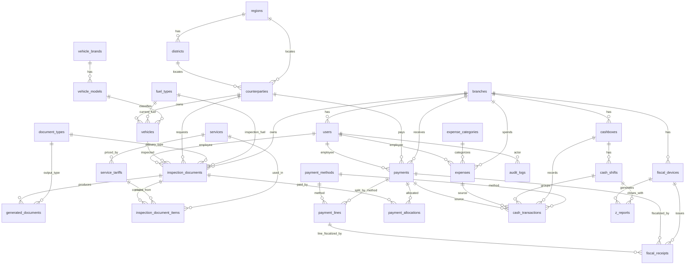

# ERD

```mermaid
erDiagram
    branches ||--o{ users : has
    branches ||--o{ inspection_documents : owns
    branches ||--o{ payments : receives
    branches ||--o{ expenses : spends
    branches ||--o{ cashboxes : has
    branches ||--o{ fiscal_devices : has

    regions ||--o{ districts : has
    regions ||--o{ counterparties : locates
    districts ||--o{ counterparties : locates

    vehicle_brands ||--o{ vehicle_models : has
    vehicle_models ||--o{ vehicles : classifies
    fuel_types ||--o{ vehicles : current_fuel
    fuel_types ||--o{ inspection_documents : inspection_fuel
    document_types ||--o{ inspection_documents : primary_type
    document_types ||--o{ generated_documents : output_type

    counterparties ||--o{ vehicles : owns
    counterparties ||--o{ inspection_documents : requests
    counterparties ||--o{ payments : pays
    vehicles ||--o{ inspection_documents : inspected

    services ||--o{ service_tariffs : priced_by
    services ||--o{ inspection_document_items : used_in
    service_tariffs ||--o{ inspection_document_items : priced_from
    inspection_documents ||--o{ inspection_document_items : contains
    inspection_documents ||--o{ generated_documents : produces

    payments ||--o{ payment_lines : split_by_method
    payments ||--o{ payment_allocations : allocated
    inspection_documents ||--o{ payment_allocations : paid_by
    payment_methods ||--o{ payment_lines : method
    payment_methods ||--o{ cash_transactions : method

    cashboxes ||--o{ cash_shifts : has
    cashboxes ||--o{ cash_transactions : records
    cash_shifts ||--o{ cash_transactions : groups
    cash_shifts ||--o{ z_reports : closes_with

    expense_categories ||--o{ expenses : categorizes
    expenses ||--o{ cash_transactions : source
    payments ||--o{ cash_transactions : source

    fiscal_devices ||--o{ fiscal_receipts : issues
    fiscal_devices ||--o{ z_reports : generates
    payments ||--o{ fiscal_receipts : fiscalized_by
    payment_lines ||--o{ fiscal_receipts : line_fiscalized_by

    users ||--o{ inspection_documents : employee
    users ||--o{ payments : employee
    users ||--o{ expenses : employee
    users ||--o{ audit_logs : actor
```

